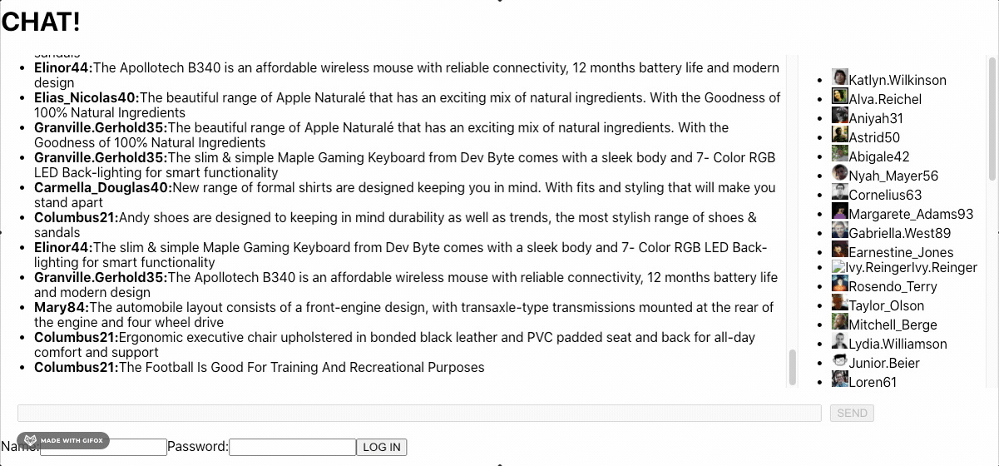

# Mocked up chatroom
Demonstrating the capabilities of MSW programmable mocks, this is a proof of concept for a long polling chatroom that in development mode appears to work with made up participants and made up messages in a realistic manner.

# Installation
Clone, `yarn start`, log in with any name (your messages will appear too) and have fun.
